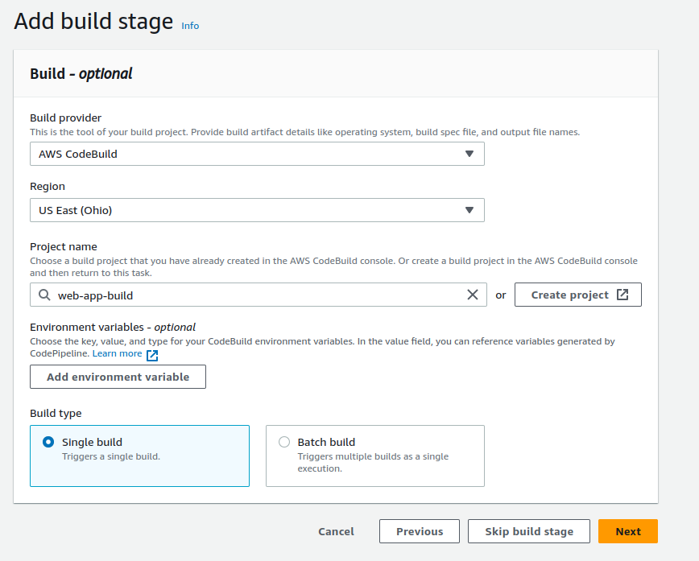

<!-- Improved compatibility of back to top link: See: https://github.com/othneildrew/Best-README-Template/pull/73 -->
<a name="readme-top"></a>
<!--
*** Thanks for checking out the Best-README-Template. If you have a suggestion
*** that would make this better, please fork the repo and create a pull request
*** or simply open an issue with the tag "enhancement".
*** Don't forget to give the project a star!
*** Thanks again! Now go create something AMAZING! :D
-->


<!-- PROJECT SHIELDS -->
<!--
*** I'm using markdown "reference style" links for readability.
*** Reference links are enclosed in brackets [ ] instead of parentheses ( ).
*** See the bottom of this document for the declaration of the reference variables
*** for contributors-url, forks-url, etc. This is an optional, concise syntax you may use.
*** https://www.markdownguide.org/basic-syntax/#reference-style-links
-->
<!-- [![Contributors][contributors-shield]][contributors-url]
[![Forks][forks-shield]][forks-url]
[![Stargazers][stars-shield]][stars-url]
[![Issues][issues-shield]][issues-url]
[![MIT License][license-shield]][license-url]
[![LinkedIn][linkedin-shield]][linkedin-url] -->

# AWS CI/CD for deploying a FastAPI application 

<!-- PROJECT LOGO -->
<!-- <br />
<div align="center">
  <a href="https://github.com/github_username/repo_name">
    
  </a>

<h3 align="center">project_title</h3>

  <p align="center">
    project_description
    <br />
    <a href="https://github.com/github_username/repo_name"><strong>Explore the docs »</strong></a>
    <br />
    <br />
    <a href="https://github.com/github_username/repo_name">View Demo</a>
    ·
    <a href="https://github.com/github_username/repo_name/issues">Report Bug</a>
    ·
    <a href="https://github.com/github_username/repo_name/issues">Request Feature</a>
  </p>
</div> -->


<!-- ABOUT THE PROJECT -->
<!-- ## About The Project

[![Product Name Screen Shot][product-screenshot]](https://example.com)

Here's a blank template to get started: To avoid retyping too much info. Do a search and replace with your text editor for the following: `github_username`, `repo_name`, `twitter_handle`, `linkedin_username`, `email_client`, `email`, `project_title`, `project_description`

<p align="right">(<a href="#readme-top">back to top</a>)</p> -->


<!-- ### Built With

* [![Next][Next.js]][Next-url]
* [![React][React.js]][React-url]
* [![Vue][Vue.js]][Vue-url]
* [![Angular][Angular.io]][Angular-url]
* [![Svelte][Svelte.dev]][Svelte-url]
* [![Laravel][Laravel.com]][Laravel-url]
* [![Bootstrap][Bootstrap.com]][Bootstrap-url]
* [![JQuery][JQuery.com]][JQuery-url]

<p align="right">(<a href="#readme-top">back to top</a>)</p>
 -->


<!-- GETTING STARTED -->
## Goal

This is a guideline on how to setup a simple CI-CD pipeline using AWS services for deploying a FastAPI application on develop/staging/production environments.


## Set up the CI/CD pipeline

### 1. CodeCommit:
* Create CodeCommit credentials for pushing and pulling source code.
* The repo has 2 branches: `dev` and `master`
* Directory structure:
    ```
    .
    ├── app
    │   └── main.py
    ├── appspec.yml
    ├── buildspec.yml
    ├── Dockerfile
    ├── .flake8
    ├── .gitignore
    ├── images
    ├── README.md
    ├── requirements.txt
    ├── scripts
       ├── after-install.sh
       ├── app-start.sh
       ├── app-stop.sh
       ├── push-image.sh
       └── validate.sh

    ```
* The repo includes:
    * FastAPI application source code.
        ```python
        # In ./app/main.py
        from fastapi import FastAPI

        app = FastAPI()


        @app.get('/')
        async def root():
            return {'greeting': 'Hello from root function'}


        @app.get('/{name}')
        async def hello(name: str):
            return {'greeting': f'Hello {name}!'}

        ```
    * CI pipeline: **buildspec.yml**
        ```yml
        # In ./buildspec.yml
        version: 0.2

        phases:
        install:
            runtime-versions:
            python: 3.11
            commands:
            # - nohup /usr/local/bin/dockerd --host=unix:///var/run/docker.sock --host=tcp://127.0.0.1:2375 --storage-driver=overlay2 &
            - timeout 15 sh -c "until docker info; do echo .; sleep 1; done"
            - pip install -r requirements.txt
        pre_build:
            commands:
            - echo Pre-build phase
            - echo Logging in to Amazon ECR...
            - aws ecr get-login-password --region $AWS_DEFAULT_REGION | docker login --username AWS --password-stdin $AWS_ACCOUNT_ID.dkr.ecr.$AWS_DEFAULT_REGION.amazonaws.com
        build:
            commands:
            - echo Build phase
            - echo Build started on `date`
            - echo Run Lint tests
            - printenv
            - flake8    
            - echo "Building the Docker image (image tag - $IMAGE_TAG)..."      
            - docker build -t my-image:$IMAGE_TAG .
        post_build:
            commands:
            - echo Post-build phase
            - echo Build completed on `date`
            - echo Pushing the Docker image...
            - chmod +x scripts/push-image.sh && sh scripts/push-image.sh
        artifacts:
        files:
            - ./appspec.yml
            - ./scripts/*
            
        
        ```
    * CD pipeline: **appspec.yml**
        ```yml
        # In ./appspec.yml
        version: 0.0
        os: linux 
        hooks:
            ApplicationStop:
                - location: scripts/app-stop.sh
                timeout: 10
                runas: root

            AfterInstall:
                - location: scripts/after-install.sh
                timeout: 10
                runas: root
            ApplicationStart:
                - location: scripts/app-start.sh     
                timeout: 10
                runas: root
            ValidateService:
                - location: scripts/validate.sh
                timeout: 30
                runas: root
        ```
    * Dockerfile and requirements.txt for the FastAPI application.
        ```dockerfile
        FROM python:3.9-slim

        WORKDIR /code

        RUN apt-get update \
        && apt-get install -y --no-install-recommends \
                curl\
        && apt-get autoremove -yqq --purge \
        && apt-get clean \
        && rm -rf /var/lib/apt/lists/*

        COPY ./requirements.txt /code/requirements.txt

        RUN pip install --no-cache-dir --upgrade -r /code/requirements.txt

        COPY ./app /code/app

        CMD ["uvicorn", "app.main:app", "--host", "0.0.0.0", "--port", "80"]

        ```
    * Scripts for each hook in the CD pipeline: in `./scripts/` directory. Somme scripts are hard-coded so they may need to be modified during the setup process.
    > **IMPORTANT:** Before you begin, make sure to check these scripts and modify some hard-coded variables such as ECR repo names, deployment group names, AWS account id,.. to fit your requirements.
### 2. Codebuild:
* Click **Create build projects** and configure the codebuild pipline:
    * `Project configuration` section: project name
    * `Source` section:

        

    * `Environment` section: Remember to add environment variables in the additional configuration.

        

        
        * `*_REPO` variables are the names of the ECR repositories created for dev, staging, prod environments.

    * Just leave the default configuration for other sections and watch out for the errors for not having proper permissions
* Try to create a build and if it succeeds, you are good to go!

### 3. Codedeploy
* 3 EC2 instances need to be set up for 3 stages of the deployment process. Here a `Launch template` is used to easily create instances having the same system configuration. Their OS should be Ubuntu 20.04 and other settings can be configured at your own choice. Remember to add the following commands to `User data` in the advanced settings and attach to an IAM role having CodeDeploy related permissions for these instances and change their names after created. **Remember to change the region YOUR_REGION in the codedeploy download link to your current region** in the script below:

    ```bash
    #!/bin/bash
    sudo apt update
    yes | sudo apt install ruby-full wget

    cd /home/ubuntu
    wget https://aws-codedeploy-{YOUR_REGION}.s3.{YOUR_REGION}.amazonaws.com/latest/install
    chmod +x ./install
    sudo ./install auto > /tmp/logfile
    sudo service codedeploy-agent start

    curl -fsSL https://get.docker.com -o get-docker.sh
    sudo sh get-docker.sh

    curl "https://awscli.amazonaws.com/awscli-exe-linux-x86_64.zip" -o "awscliv2.zip"
    unzip awscliv2.zip
    sudo ./aws/install

    ```
    > **_IMPORTANT:_**  default profile must be configured in the instances for docker commands to run successfully.

    

    > **Note:** `sudo service codedeploy-agent restart` for the attached role to take effect


* Create application in CodeDeploy and 3 deployment groups for 3 stages of deployment:
  * Create an application:

    

  * Create a dev deployment group inside the created application. You should name the deployment groups `dev-web-app-deployment`, `staging-web-app-deployment`, `prod-web-app-deployment` so that some of the hard-coded parts in available scripts don't need to be changed:

    

    

    > **Note:** the value of the key "Name" in the tag group must be the name of the instance of the environment you want to deploy.

     

  * Repeat these steps similarly for the other stages (staging, prod)

### 4. CodePipeline
* Create 2 pipelines, one for each branch of the git repository: `master` (default) and `dev`
* Pipeline for dev branch:

  

  

  

  > **IMPORTANT:** Add BRANCH_NAME to the environment variables as shown below:
  

  

  * When the pipeline is created, it will automatically run and should return successful status.

* Pipeline for master branch: Clone the dev pipeline and make some modifications:

  

  

  * Edit Source stage in the cloned pipeline: change branch `dev` to `master` and save.

  * Edit Deploy stage to have `Staging` and `Production` deployment.

    Modify the existing block in the `Deploy` stage as shown below:

    
  
    Add action group below the `Staging` block with configuration below:
    
    

  * The resulted pipeline will be like this:

    

<!-- <p align="right">(<a href="#readme-top">back to top</a>)</p> -->
## Referenes:
* <a href="https://docs.aws.amazon.com/codebuild/latest/userguide/build-spec-ref.html">Build specification reference for CodeBuild</a>
* <a href="https://docs.aws.amazon.com/codepipeline/index.html">AWS CodePipeline Documentation</a>
* <a href="https://docs.aws.amazon.com/codedeploy/index.html">AWS CodeDeploy Documentation</a>
* <a href="https://fastapi.tiangolo.com/">FastAPI</a>


<!-- ## Contact

Phan Dai Duong - phandaiduong@gmail.com

Project Link: [https://github.com/github_username/repo_name](https://github.com/github_username/repo_name)

<p align="right">(<a href="#readme-top">back to top</a>)</p> -->


<!-- MARKDOWN LINKS & IMAGES -->
<!-- https://www.markdownguide.org/basic-syntax/#reference-style-links -->
[contributors-shield]: https://img.shields.io/github/contributors/github_username/repo_name.svg?style=for-the-badge
[contributors-url]: https://github.com/github_username/repo_name/graphs/contributors
[forks-shield]: https://img.shields.io/github/forks/github_username/repo_name.svg?style=for-the-badge
[forks-url]: https://github.com/github_username/repo_name/network/members
[stars-shield]: https://img.shields.io/github/stars/github_username/repo_name.svg?style=for-the-badge
[stars-url]: https://github.com/github_username/repo_name/stargazers
[issues-shield]: https://img.shields.io/github/issues/github_username/repo_name.svg?style=for-the-badge
[issues-url]: https://github.com/github_username/repo_name/issues
[license-shield]: https://img.shields.io/github/license/github_username/repo_name.svg?style=for-the-badge
[license-url]: https://github.com/github_username/repo_name/blob/master/LICENSE.txt
[linkedin-shield]: https://img.shields.io/badge/-LinkedIn-black.svg?style=for-the-badge&logo=linkedin&colorB=555
[linkedin-url]: https://linkedin.com/in/linkedin_username
[product-screenshot]: images/screenshot.png
[Next.js]: https://img.shields.io/badge/next.js-000000?style=for-the-badge&logo=nextdotjs&logoColor=white
[Next-url]: https://nextjs.org/
[React.js]: https://img.shields.io/badge/React-20232A?style=for-the-badge&logo=react&logoColor=61DAFB
[React-url]: https://reactjs.org/
[Vue.js]: https://img.shields.io/badge/Vue.js-35495E?style=for-the-badge&logo=vuedotjs&logoColor=4FC08D
[Vue-url]: https://vuejs.org/
[Angular.io]: https://img.shields.io/badge/Angular-DD0031?style=for-the-badge&logo=angular&logoColor=white
[Angular-url]: https://angular.io/
[Svelte.dev]: https://img.shields.io/badge/Svelte-4A4A55?style=for-the-badge&logo=svelte&logoColor=FF3E00
[Svelte-url]: https://svelte.dev/
[Laravel.com]: https://img.shields.io/badge/Laravel-FF2D20?style=for-the-badge&logo=laravel&logoColor=white
[Laravel-url]: https://laravel.com
[Bootstrap.com]: https://img.shields.io/badge/Bootstrap-563D7C?style=for-the-badge&logo=bootstrap&logoColor=white
[Bootstrap-url]: https://getbootstrap.com
[JQuery.com]: https://img.shields.io/badge/jQuery-0769AD?style=for-the-badge&logo=jquery&logoColor=white
[JQuery-url]: https://jquery.com 
